#Web3D & AR 在天猫双11互动中大规模应用
2016年天猫双11狂欢城首次推出 3D 版，以及表演的明星可以实时的把衣服以『穿越』的方式飞入用户的手机中，这些效果都是基于跨平台和可以随时更新的 Web 前端技术，前端工程师从 2D 到 3D、从跨终端适配到多屏联动、从虚拟走进了现实，这些转变让前端开发进入了多维时代。

- http://d2forum.alibaba-inc.com/#/index?_k=mizz3b

#前端开发专家
> 吴晓东（江成）
> 天猫
> 资深前端开发工程师

#前端开发专家
> 张津（肖竹）
> 天猫

# 问：有什么第3方的库

> 有开源，2d，3d串联

# webgl，背后原理为何？

> canvas, 用三角形，模拟渲染

> webgl，天生对3D亲和

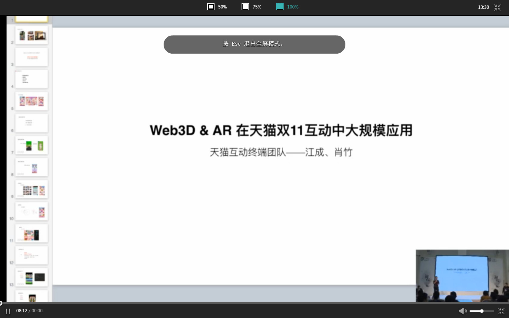

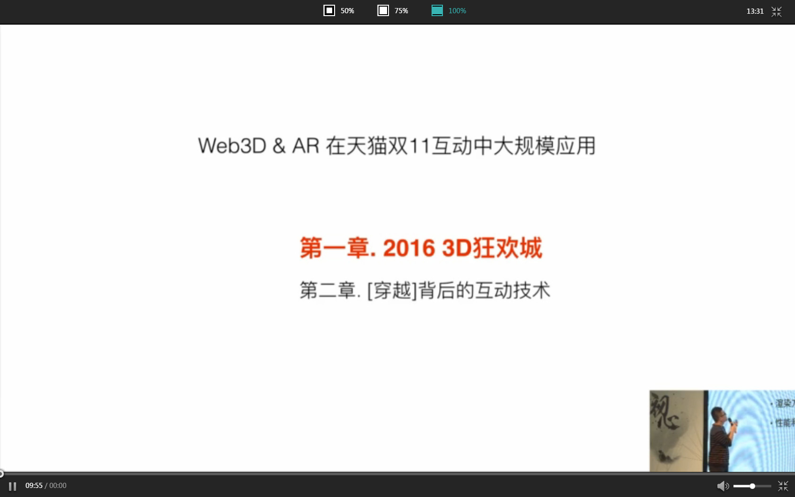
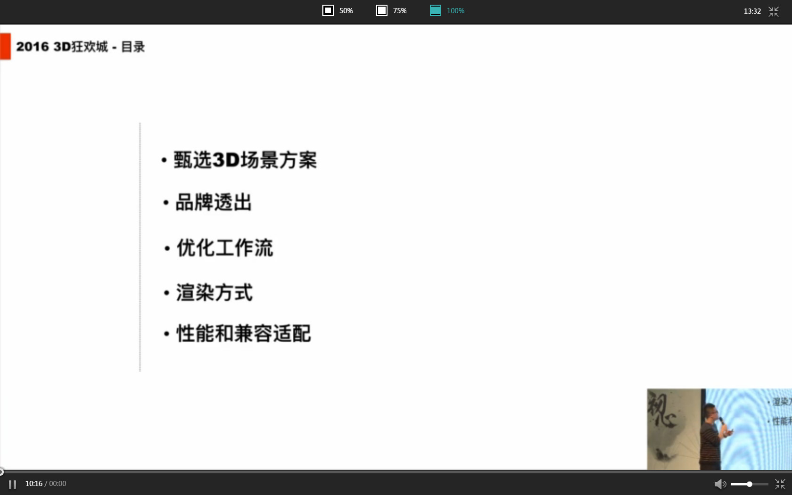

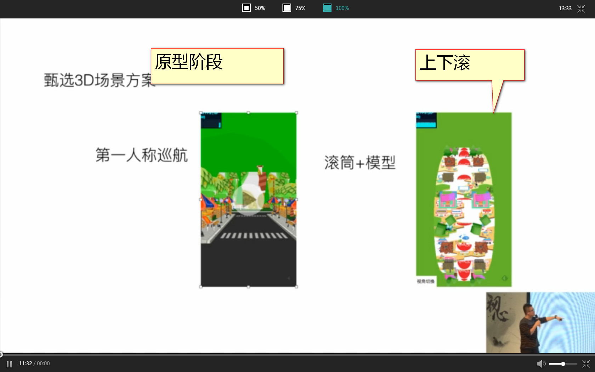

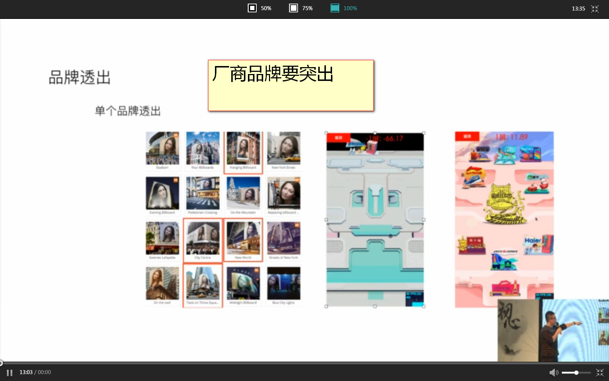
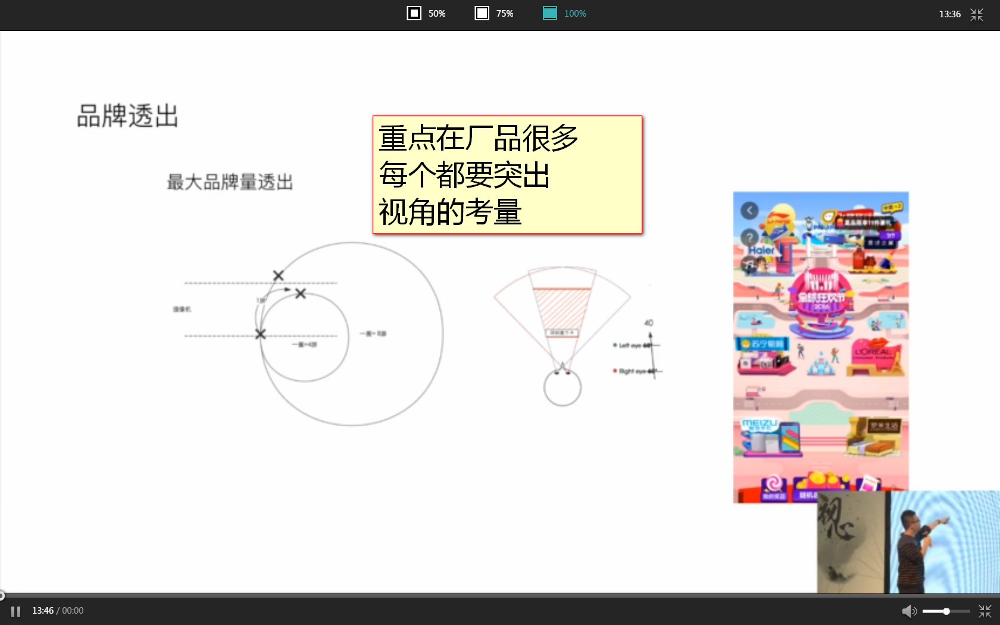
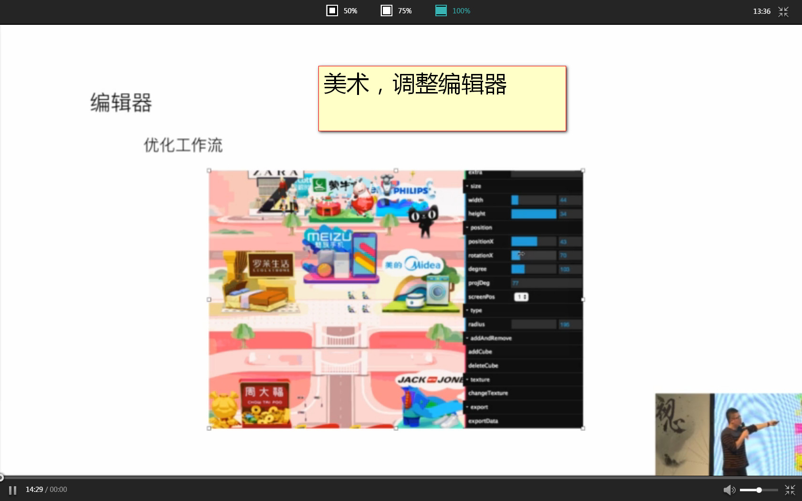

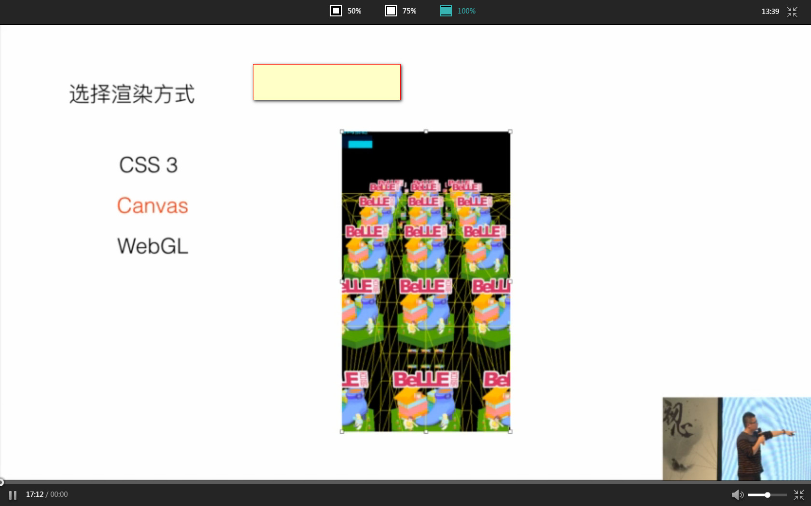

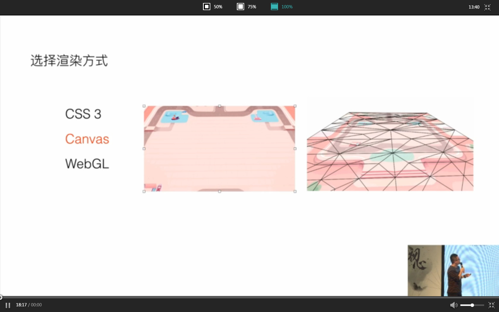
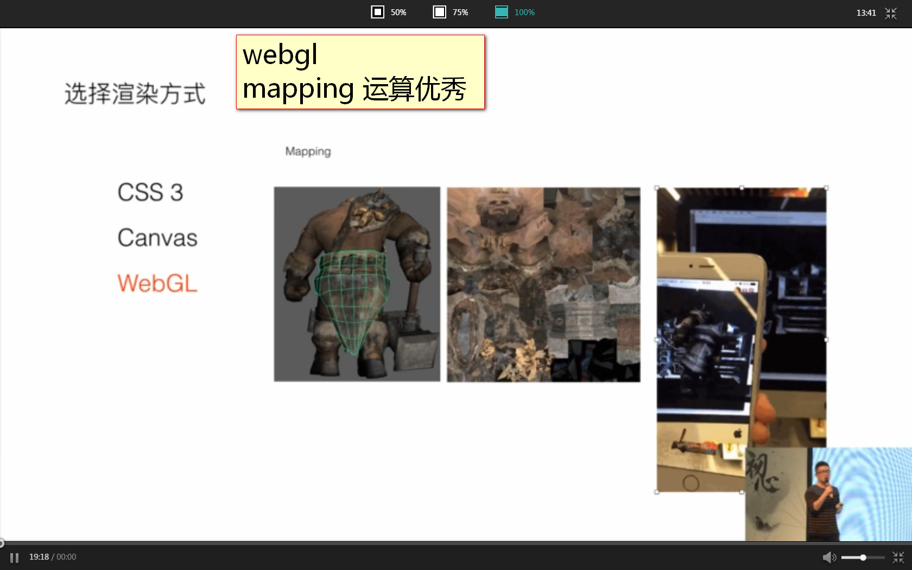

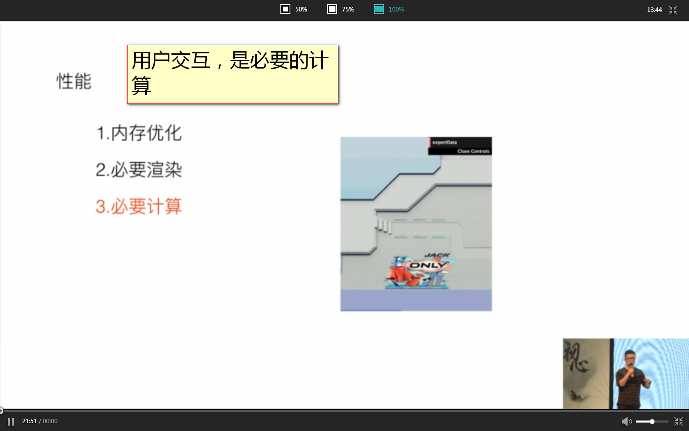
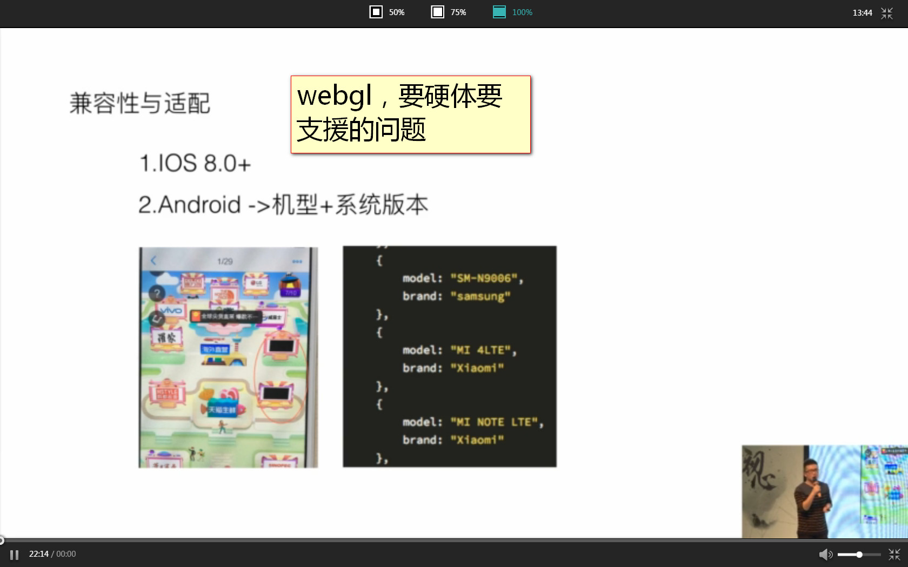

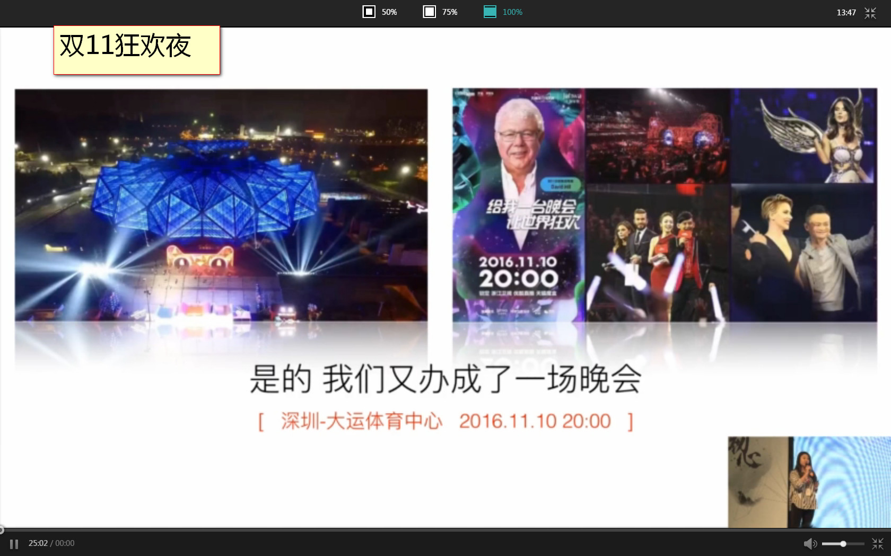

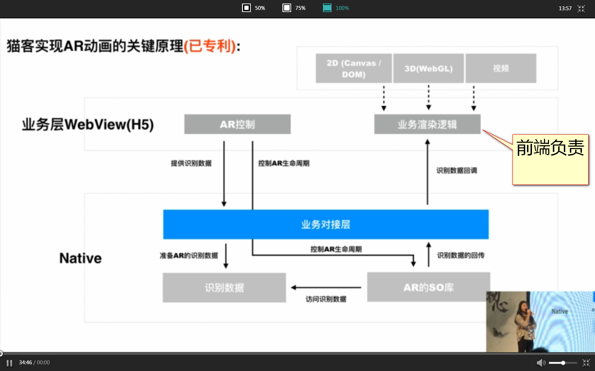

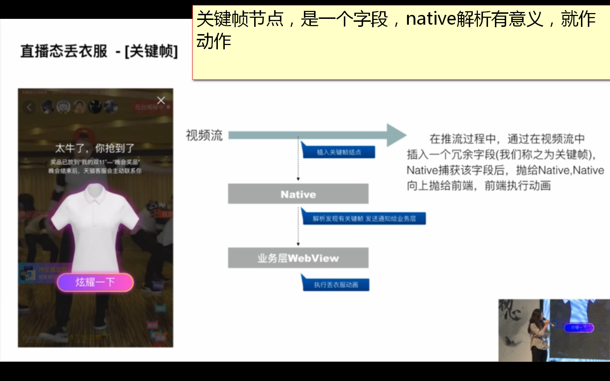
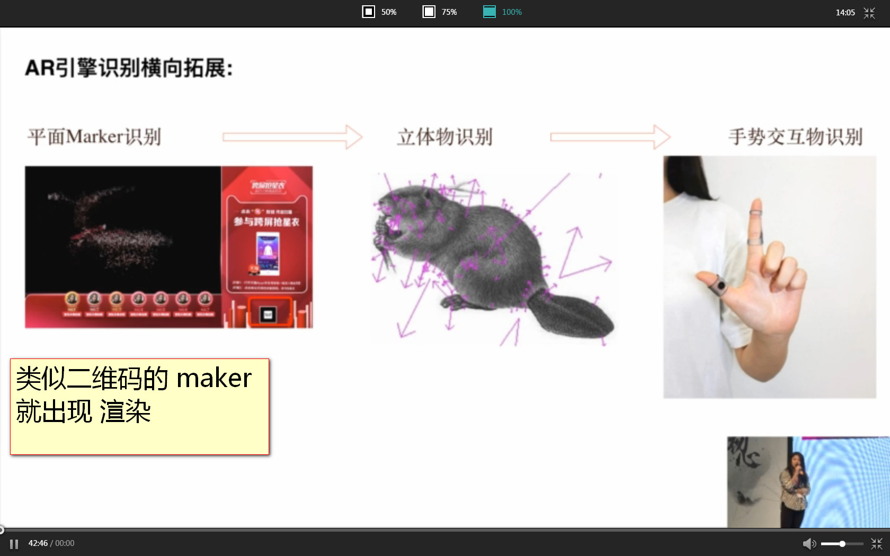

