# 从 React 到 ClojureScript

>题叶
>饿了么
>资深前端工程师

React 吸收了很多函数式编程当中的特性，比如无副作用渲染，比如不可变数据，比如高阶组件。其中一些概念来自 ClogureScript。分享当中介绍 ClogureScript 的一些特性，并且演示用 ClogureScript 写类似 React 的例子，提供给大家更多关于函数式编程和前端结合的做法。

# 问：有实际上线的企业吗？
现在研究中

# 问：代码复用的问题
要看经验

# 问：组件希望有私有状态
ClogureScript有自已的一套全局的处理方式

# react 管理异步数据
ClogureScript有自已处理异步的方式，跟react不一样

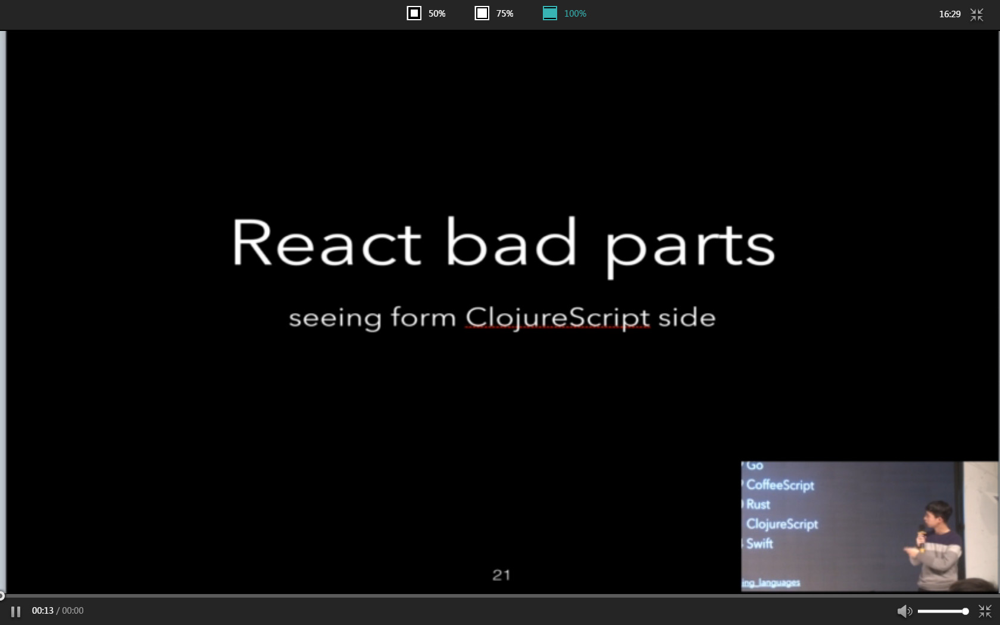

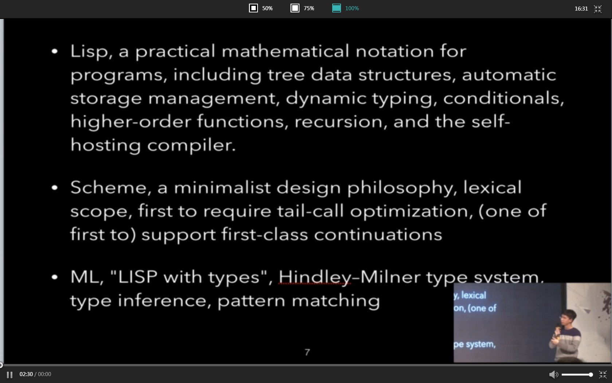

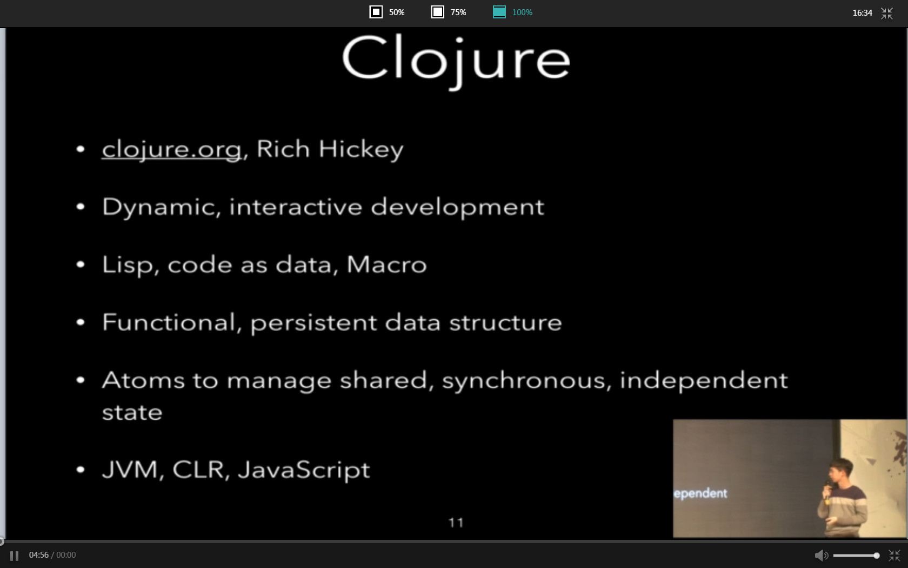
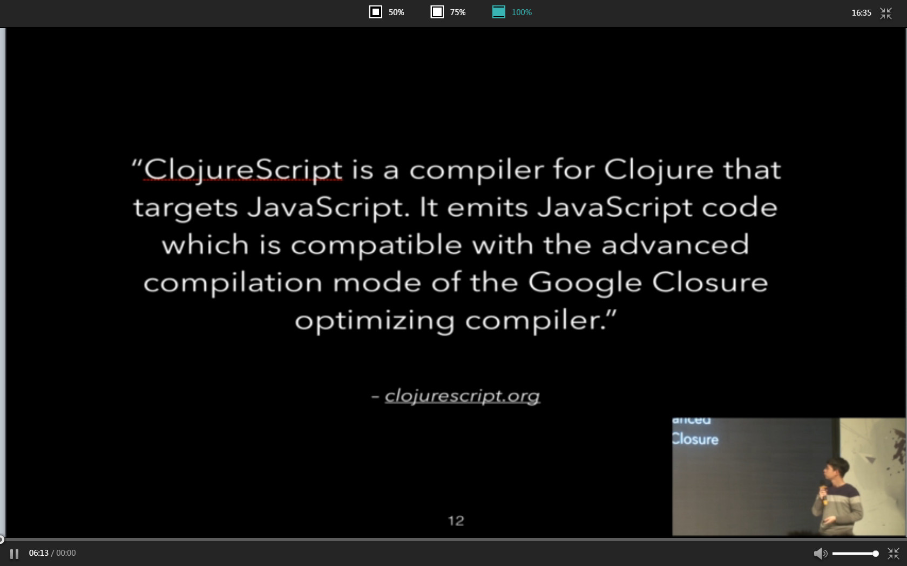

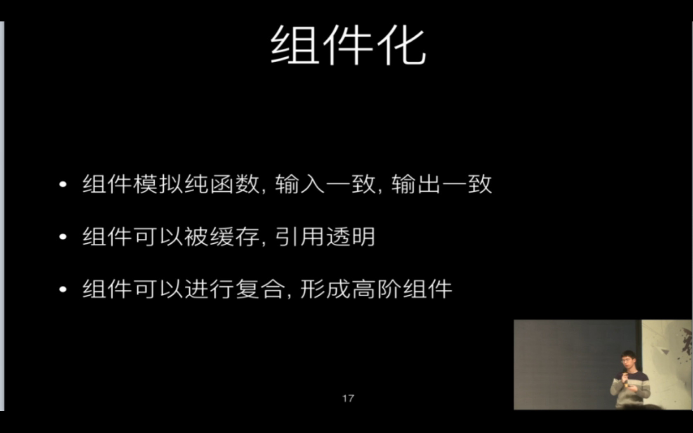
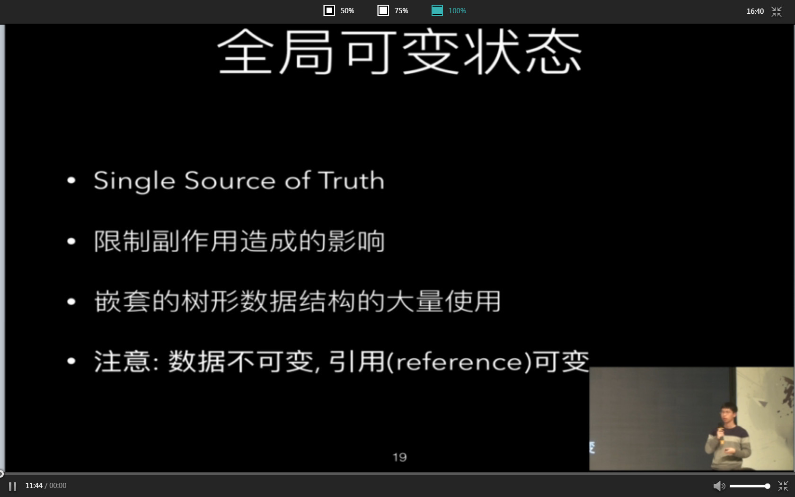
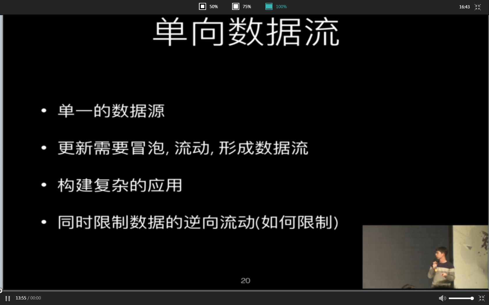

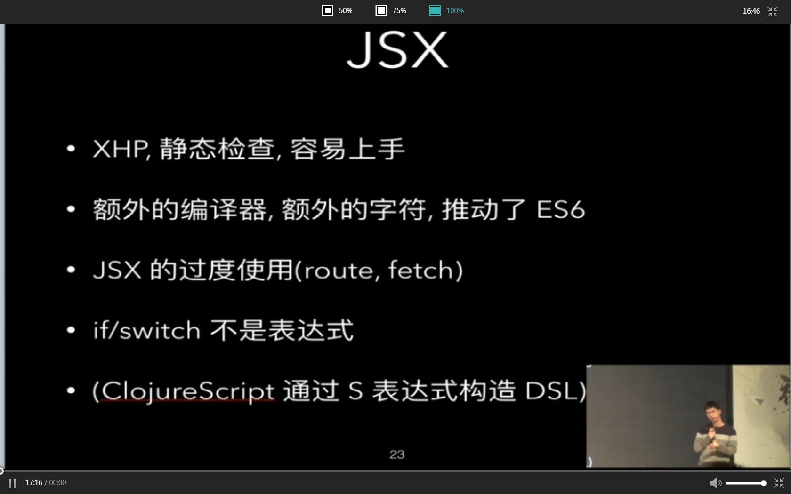

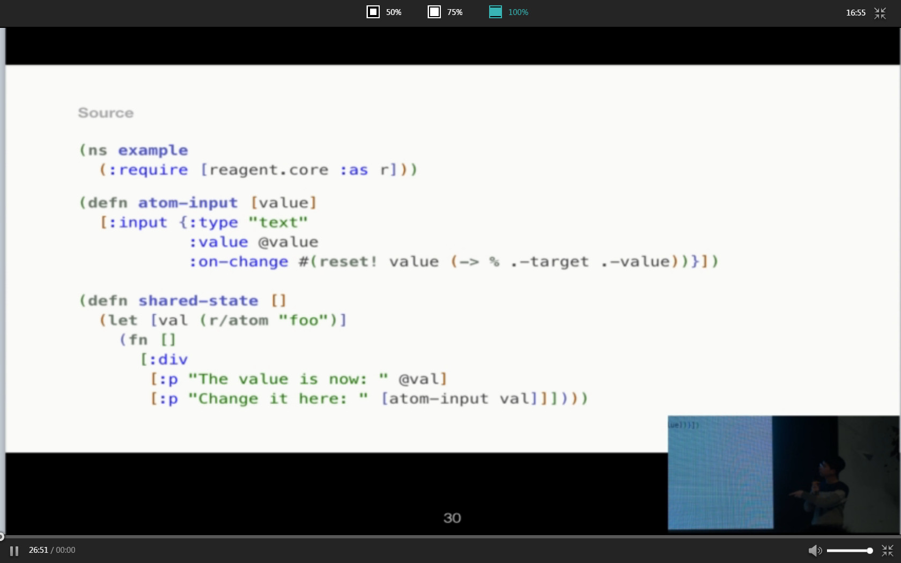
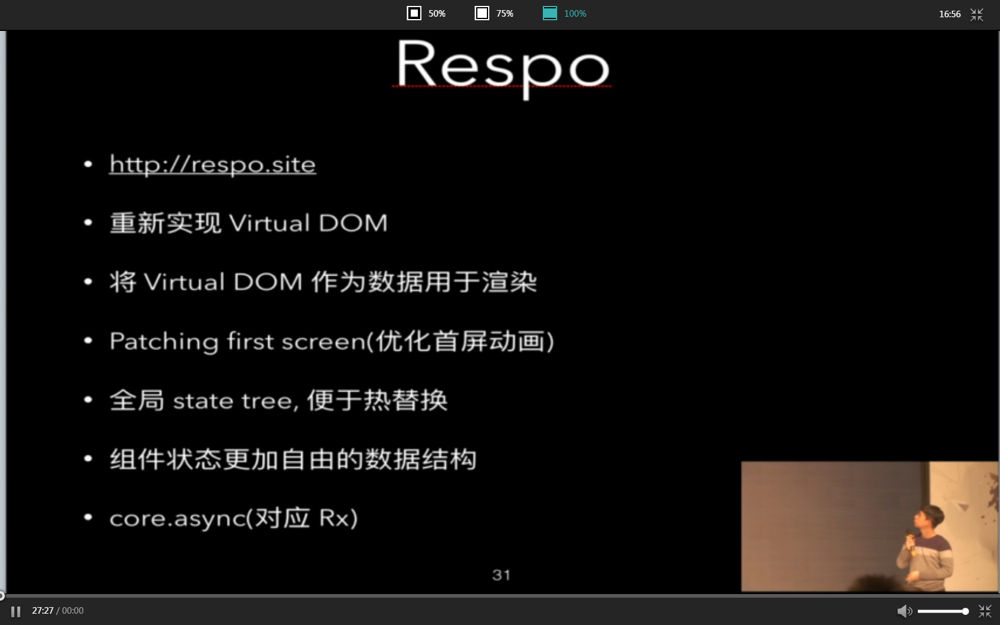

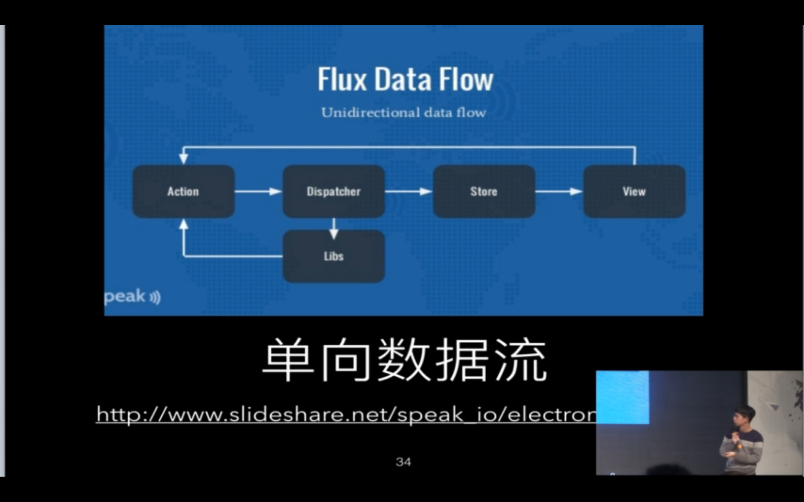

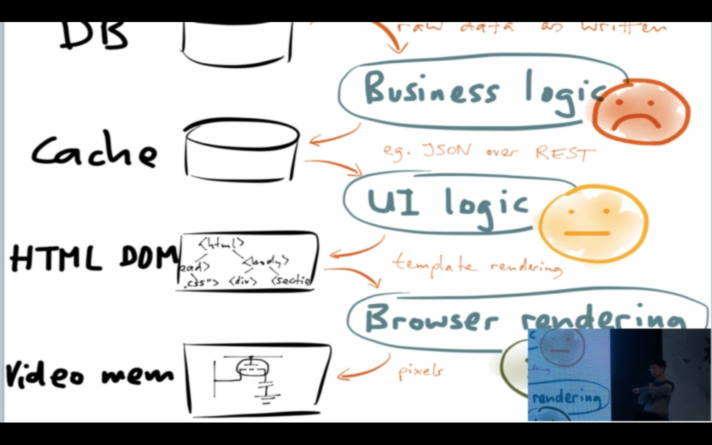
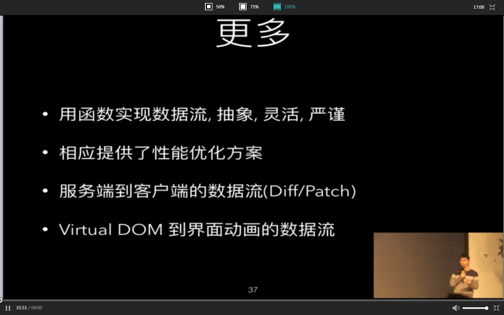

