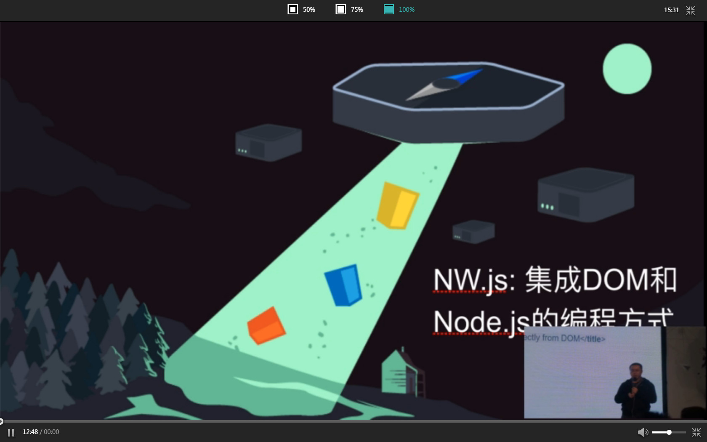
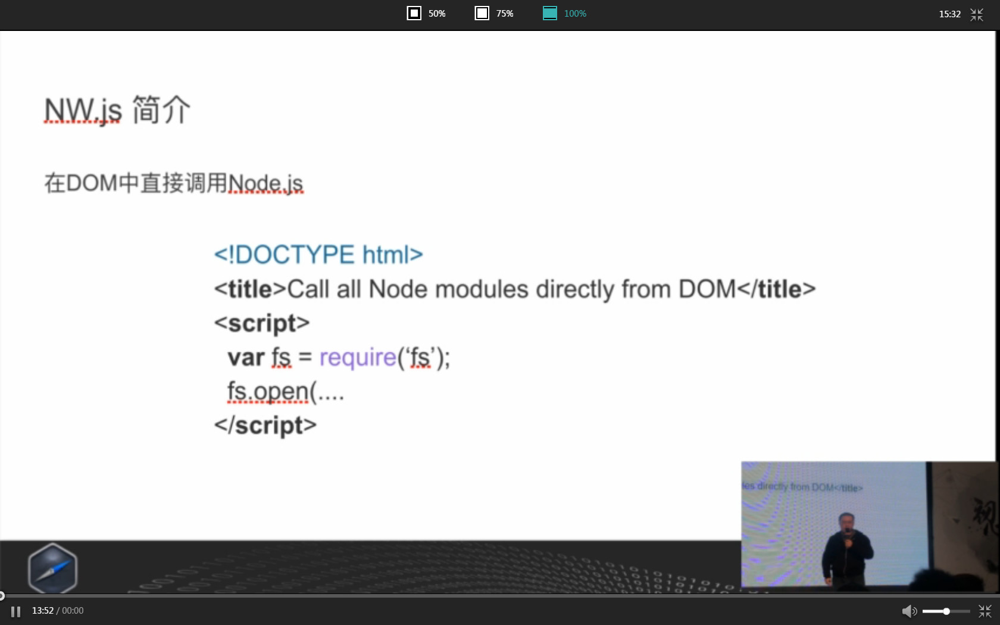
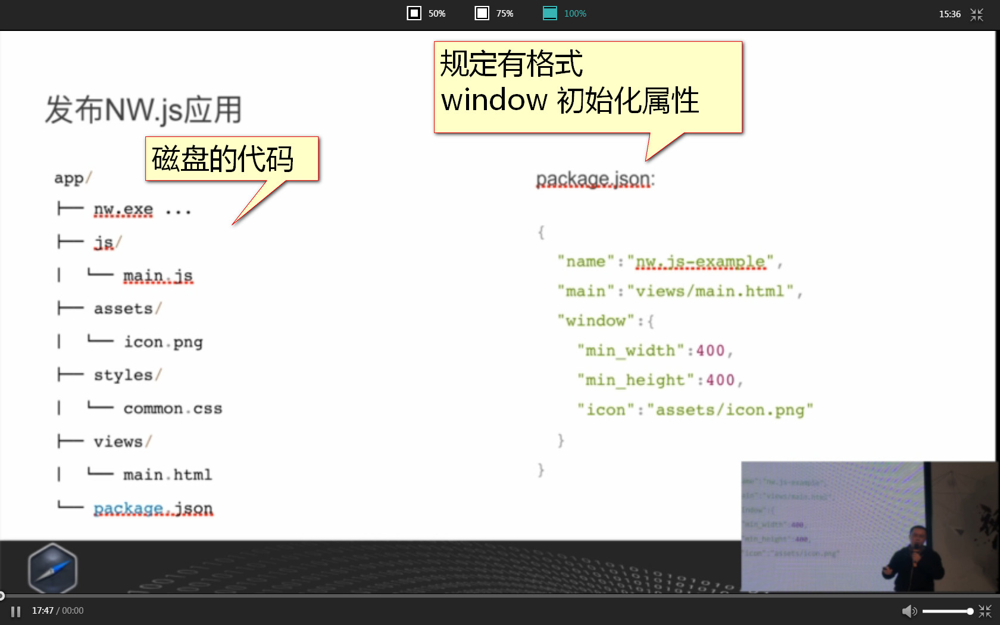
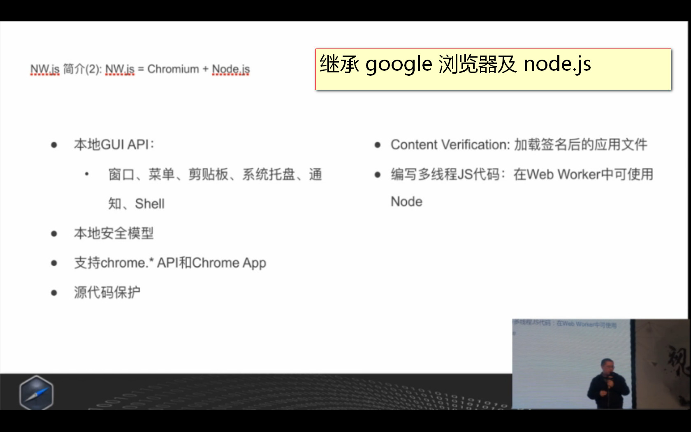
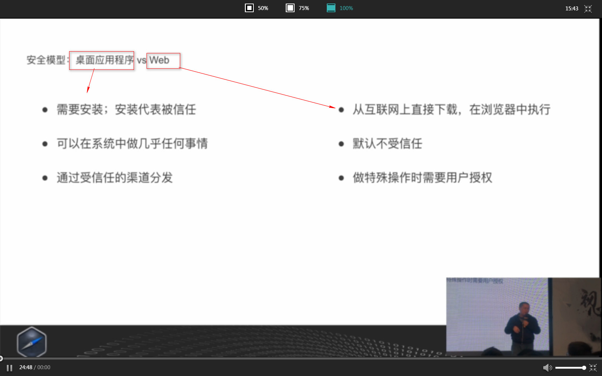
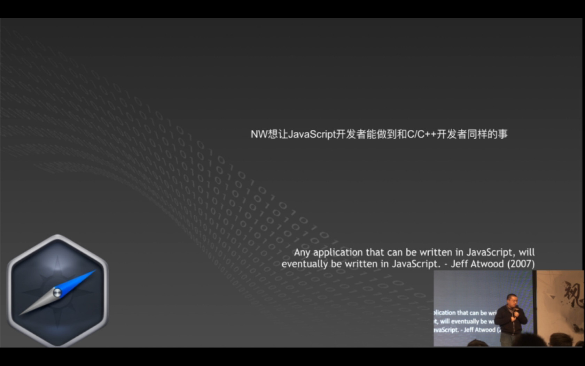
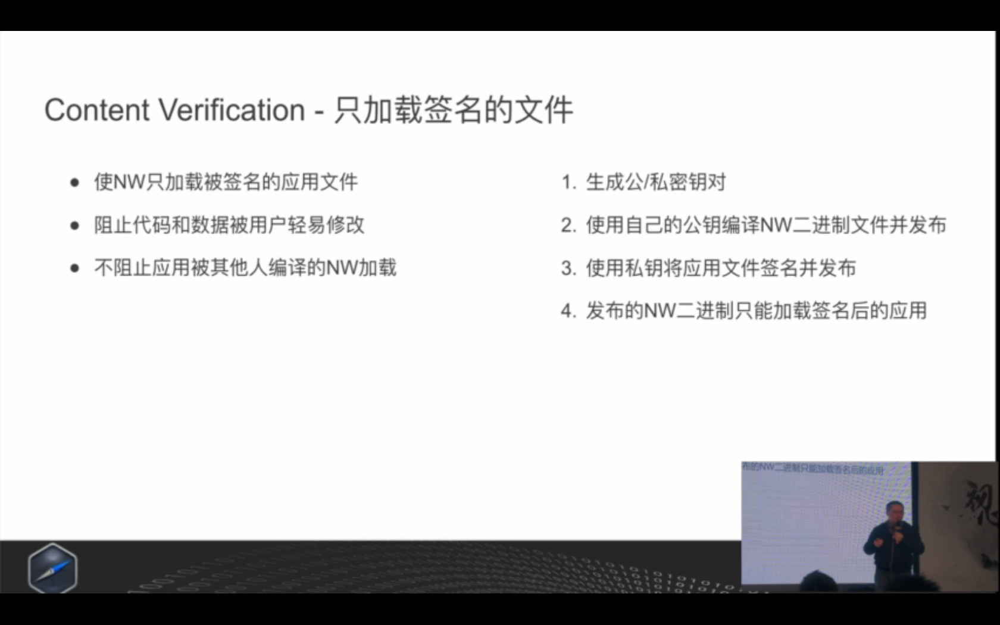
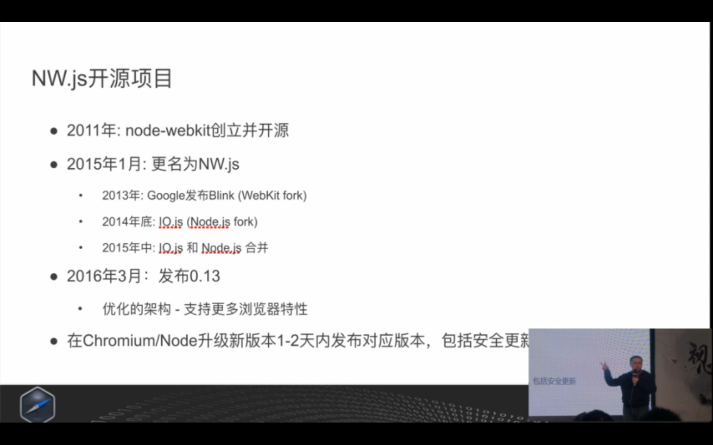
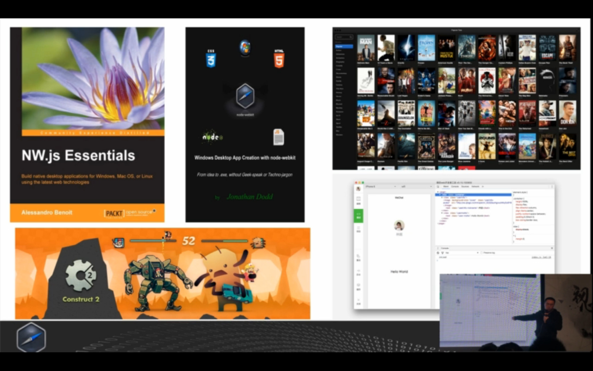
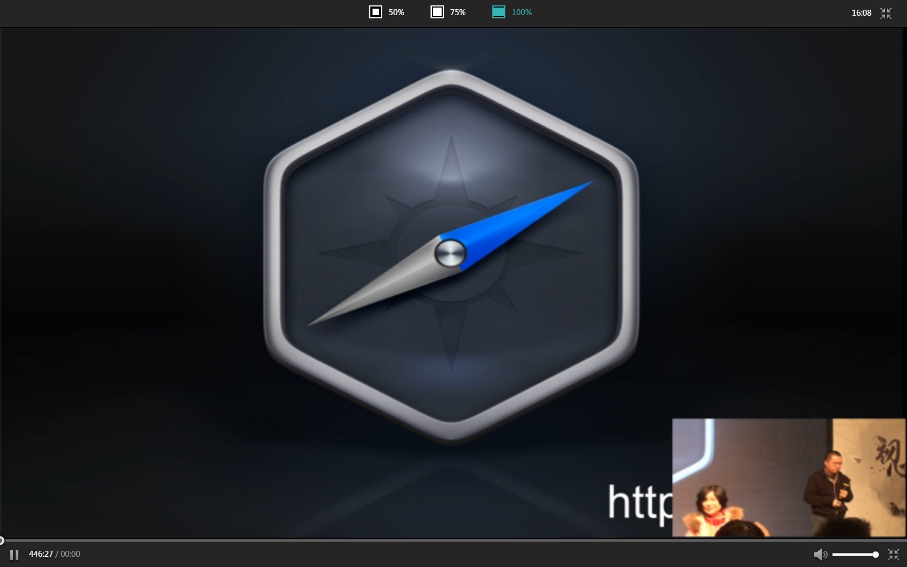

# NW.js: 集成DOM和Node.js的编程方式

>王文睿
>Intel
>架构师

NW.js (原名 node-webkit )通过集成 Chromium 和 Node.js，创造了在 DOM 中直接调用 Node.js 的本地应用编程方式。本次演讲将介绍 NW 的主要功能和最新进展，例如 W3C 之外的本地应用安全模型，源代码保护、在 Web Worker 中使用 Node 及编写多线程 Node.js 代码，并和大家分享用 Web 技术开发本地应用这一领域的看法

http://d2forum.alibaba-inc.com/#/index?_k=mizz3b

# 问：api应用

现在还无法支持

# 问：跟 c++开发有什么差距

浏览器越来越快

# 问：桌面端支持？

都支持

# 问：google 浏览器，更新，对nwjs 的影响

我们会提前作，来更新

# 问：nw 适合的场景

打印预览

#问：作截图的功能，在 macbook 有用户体验的问题

发 github ，我会去解决

# 问：nw，相等于 c++，有什么性能的优势？

介面更炫，有经验的前端开发者，更好，c++做同样的介面，会有困难

# 问：桌面交易客户端，怎么做多窗口？
使用数据缓存，多窗口，有安全性的问题

# 问：安装包很大？
会优化发布的问题

#问：加载时间长？
要看具体的原因，要找出来，才好优化

